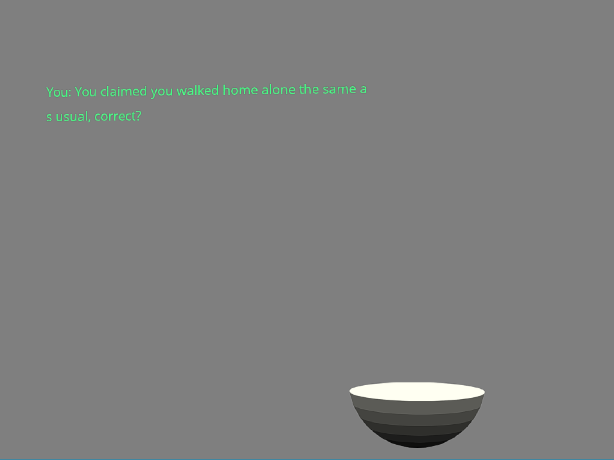

Embroiled in Lies

Author: Ben Cagan (bcagan)

Design: Embroiled in Lies follows an unfortunate soul who, only days after clearing their name after being framed for murder, finds
themselves caught at the scene of another crime, only this time, they aren't the one under suspicions. Talk to the two other mysterious
individuals, and attempt to find your way through their lies, and discover what part you play in this mystery.

Text Drawing: Text is drawn in real time. A font (true type font) is loaded into freetype at run time, and this freetype font faced
is then passed to harfbuzz. Each line is then passed to harfbuzz before its drawn, which shapes it, and then in real time the resulting
buffer is then processed, using the textures generated by freetype to render the given line in 3D space.

Screen Shot:

How To Play:

(TODO: describe the controls and (if needed) goals/strategy.)

Sources: Code references: https://learnopengl.com/In-Practice/Text-Rendering
https://www.geeksforgeeks.org/tokenizing-a-string-cpp/
https://github.com/harfbuzz/harfbuzz-tutorial/blob/master/hello-harfbuzz-freetype.c

This game was built with [NEST](NEST.md).

